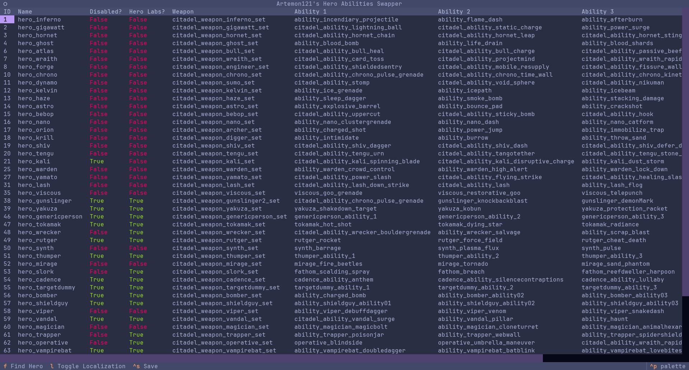

# Deadlock Ability Swapper

[](https://opensource.org/licenses/MIT)

A script to quickly swap hero abilities for ability draft.



## Installation

### Prerequisites

- [Python](https://www.python.org/downloads) (3.12 or later)
- [Poetry](https://python-poetry.org/docs/#installation)
- [Source 2 Viewer](https://valveresourceformat.github.io/)
- [fzf](https://junegunn.github.io/fzf/installation/) (must be installed and available in PATH)

### Steps

1. Clone this repository

```sh
git clone https://github.com/Artemon121/deadlock-ability-swapper
cd deadlock-ability-swapper
```

2. Install dependencies

```sh
poetry install
```

## Usage

1. Open `Deadlock/game/citadel/pak01_dir.vpk` in Source 2 Viewer, then decompile & export `scripts/heroes.vdata`
2. Copy `config.example.toml`, rename it to `config.toml` and fill out all settings in it
3. Run the script:

```sh
poetry run python app.py
```

Controls:

- Arrow Keys: Navigate
- `f`: Search heroes
- `ENTER`: Change value under cursor
- `l`: Toggle localization
- `Ctrl+S`: Save changes
- `Ctrl+Q`: Quit

4. Compile and pack the modded `heroes.vdata` like with any other Deadlock mod. I recommend using [DeadPacker](https://github.com/Artemon121/DeadPacker).
